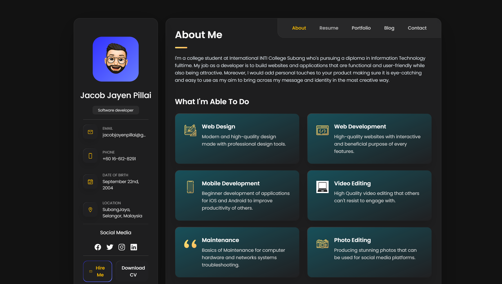

# vCard - Personal portfolio


[](https://twitter.com/intent/follow?screen_name=codewithsadee_)
[](https://youtu.be/SoxmIlgf2zM)

vCard is a fully responsive personal portfolio website, responsive for all devices, built using HTML, CSS, and JavaScript.

## Demo




## Prerequisites

Before you begin, ensure you have met the following requirements:

* [Git](https://git-scm.com/downloads "Download Git") must be installed on your operating system.

## Installing vCard

To install **vCard**, follow these steps:

Linux and macOS:

```bash
sudo git clone https://github.com/codewithsadee/vcard-personal-portfolio.git
```

Windows:

```bash
git clone https://github.com/codewithsadee/vcard-personal-portfolio.git
```

## Contact

If you want to contact me you can reach me at [Twitter](https://www.twitter.com/codewithsadee).

## License

MIT

## Changelog

### [Date]

- Moved all files and folders from the `vcard-personal-portfolio/` subdirectory to the root of the repository.
- Updated all asset references in `index.html` (and other files) to use the new root-relative paths (e.g., `assets/images/...`).
- Verified that all CSS, JS, and image links are working with the new structure.
- Fixed 404 error on GitHub Pages by ensuring `index.html` is at the root.
